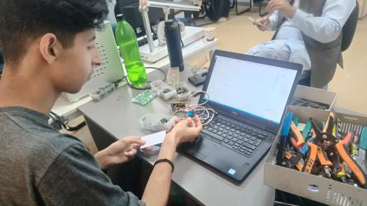
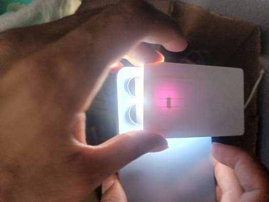
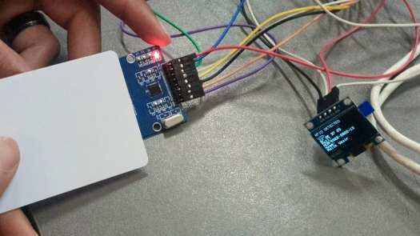

<h1 align="center">ESP32 RFID Access Control System</h1>

<p align="center">
  RFID-based identification and secure access control using ESP32-S3 and MFRC522 module.
</p>

---

## Features

- SPI-based communication between ESP32 and MFRC522 RFID module
- Real-time RFID tag detection and UID reading
- Authorized user database with access control logic
- OLED display for status and user info
- Buzzer and LED feedback for granted/denied access

---

## Hardware Requirements

| Component | Details |
|-----------|---------|
| Microcontroller | ESP32-S3 |
| RFID Module | MFRC522 |
| OLED Display | SSD1306 (128x64, I2C) |
| Buzzer | Active buzzer module |
| LED | Built-in or external |
| RFID Tags | Mifare 13.56MHz cards/fobs |

---

## Pin Connections

### RFID (SPI)

| MFRC522 Pin | ESP32-S3 Pin |
|-------------|--------------|
| SDA (SS)    | GPIO 5       |
| SCK         | GPIO 36      |
| MOSI        | GPIO 35      |
| MISO        | GPIO 37      |
| RST         | GPIO 4       |

### OLED (I2C)

| OLED Pin | ESP32-S3 Pin |
|----------|--------------|
| SDA      | GPIO 8       |
| SCL      | GPIO 9       |

### Other

| Component | ESP32-S3 Pin |
|-----------|--------------|
| Buzzer    | GPIO 10      |
| LED       | GPIO 2       |

### RFID Module Internal Circuit

<p align="center">
  
</p>

---

## Modules

### Basic RFID Reader

Simple RFID UID reader that detects tags and displays their UID in hexadecimal format on the Serial Monitor.

**Folder:** `Task1_RFID_Reader/`

**Libraries Required:**
- `SPI.h` (built-in)
- `MFRC522.h` (install via Library Manager)

#### Output

<p align="center">
  
</p>

```
RFID UID Reader
Scan your card...
UID: A1 B2 C3 D4
```

---

### Secure Access Control

Advanced RFID authentication system with:
- Authorized user database (UID -> Name)
- OLED display for real-time output
- Buzzer feedback (short beep for granted, long beep for denied)
- LED indicator for access status

**Folder:** `Task2_Secure_Identification/`

**Libraries Required:**
- `SPI.h` (built-in)
- `MFRC522.h`
- `Wire.h` (built-in)
- `Adafruit_GFX.h`
- `Adafruit_SSD1306.h`

#### Output

<p align="center">
  
</p>

**Authorized:**
```
UID: 67 9E 37 25
Name: Malik Uzair
Access Granted
```

**Unauthorized:**
```
UID: AA BB CC DD
Access Denied
```

---

## How to Upload

1. Open Arduino IDE
2. Install required libraries via **Sketch > Include Library > Manage Libraries**
3. Select board: **ESP32-S3 Dev Module**
4. Select the correct COM port
5. Upload the `.ino` file from the respective folder

---

## Theory

### SPI Communication
SPI (Serial Peripheral Interface) is a synchronous, full-duplex protocol using four lines:
- **MOSI** - Master Out Slave In
- **MISO** - Master In Slave Out
- **SCK** - Clock Signal
- **SS** - Slave Select

### RFID Identification
The MFRC522 operates at 13.56MHz. When a tag enters the reader's field, it responds with its unique UID. The ESP32 reads this UID via SPI and compares it against an authorized database to grant or deny access.
